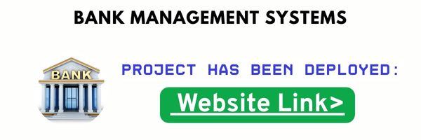

[](https://sanjeeb.pythonanywhere.com/)

# Bank Management System

## About

Bank Management Systems play a vital role in streamlining financial operations, ensuring secure transactions, and enhancing the overall customer experience. These systems help banks manage data efficiently and offer a centralized platform for handling accounts, customers, and financial activities. A robust bank management system increases operational efficiency and reduces human error.

## Project Overview

This project is a simple yet powerful Bank Management System designed to manage customer data, bank accounts, and financial transactions with ease. The system also includes basic analytics to give insights into overall operations and usage patterns.

### Key Components

The application is centered around three main data tables:

- **Customers** – Stores customer details such as name, contact, and identification information.
- **Accounts** – Maintains account details including account numbers, types, balances, and associated customer IDs.
- **Transactions** – Logs deposits, withdrawals, and transfers along with timestamps and account references.

## Features

- Full **CRUD** operations on customers, accounts, and transactions
- Ability to **add new users** and open new accounts
- View **transaction history** for individual accounts
- Perform **deposit, withdrawal, and fund transfer**
- **Analytics dashboard** to monitor overall data insights

## Technologies Used

- **Flask** – Backend web framework for handling server-side logic and routing  
- **MySQL** – Relational database for storing customer, account, and transaction data  
- **Python** – Core programming language used for backend development  
- **HTML, CSS, JavaScript** – Frontend technologies for creating a responsive user interface

## Getting Started

### 1. Our Website

You can visit the deployed version of the project here:  
[Website Link](https://sanjeeb.pythonanywhere.com/)

### 2. Run Locally

Follow the steps below to set up and run the project locally:

```bash
# Clone the repository
git clone https://github.com/codesdred/Bank-Management-System.git

# Navigate to the project directory
cd bank-management-system

# Install required libraries
pip install flask
pip install flask-mysqldb

# Run the application
python app.py
